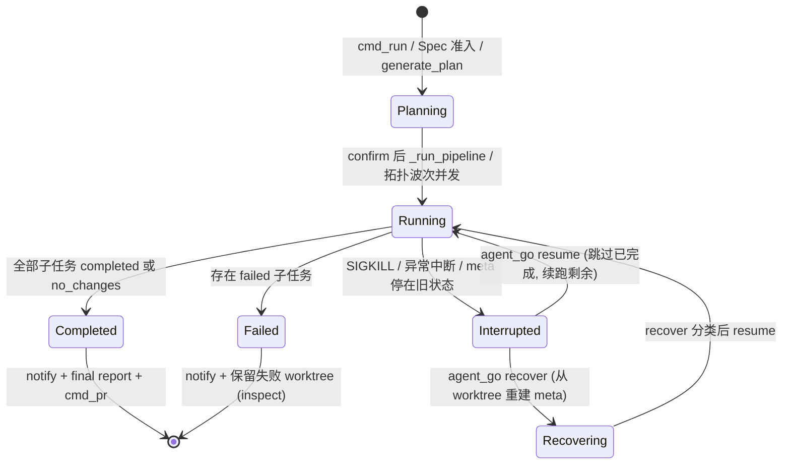
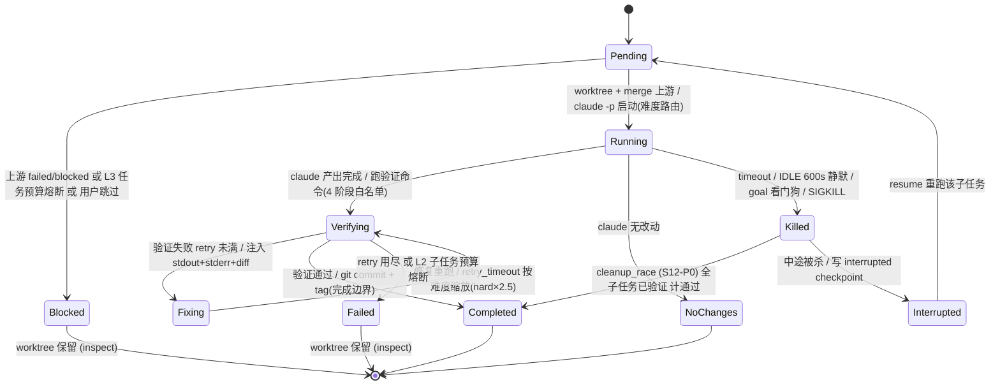

# agent_go 架构设计

> 一人维护，写下来是为了 6 个月后做决策时不重新考古
>
> **文档分层**：本文是 As-Built 技术架构；功能流程见 [design/functional-architecture.md](design/functional-architecture.md)，交付边界见 [design/delivery-design.md](design/delivery-design.md)，验证见 [design/verification-design.md](design/verification-design.md)，模块目录见 [design/module-catalog.md](design/module-catalog.md)，系统 ADR 见 [design/adr/](design/adr/)。

> **当前基线（2026-08-08）**：产品成功以 Accepted Delivery 为边界；commit、verification、delivery 三层状态分离；Bench 按 suite 和 source batch 治理。本文中的历史 S 编号仅用于代码演进追溯，不代表当前 roadmap 阶段。

## 一句话

**agent_go 是 Claude Code 的编排层**：LLM 生成执行计划 → 拆解为子任务 → 在隔离 git worktree 中并发执行 → 验证 → commit → PR。

## 核心数据流

```
cmd_run(repo, task)
  ├── analyze_project()          → 项目文件列表
  ├── get_git_info()             → remote, branch, commit
  ├── generate_plan()            → LLM 返回结构化 JSON (plan)
  │     ├── 缓存: SHA256(task+repo) → 24h TTL
  │     ├── 路由: router.enabled 时按 planner 角色走 primary/fallback (降级留痕)
  │     ├── 计量: 每次 API 调用写 metering.jsonl (role/tokens/cost/latency)
  │     └── 降级: 外部API → 本地模型 → DECOMPOSE_RULES匹配 → 单任务兜底
  ├── confirm_plan()             → Y/S/D/E/R/N (--yes 跳过)
  ├── plan_to_subtasks()         → plan.steps → subtasks + 角色-Skill匹配 + difficulty 透传
  ├── estimate_task_duration()   → M4 时间预估 (历史中位数 × 拓扑波次)
  ├── _run_pipeline()
  │     ├── 禁用 gc.auto         → 并发 worktree 安全
  │     ├── 拓扑波次调度          → ThreadPoolExecutor, --parallel N
  │     │     └── 上游 failed/blocked → 下游标 blocked 并跳过 (block_on_failure 可关)
  │     ├── run_subtask()        → 每个子任务:
  │     │     ├── git worktree add -b agent_go/{task_id}/{sub_id}
  │     │     ├── git merge 上游 tag → 产物传递
  │     │     ├── 写 TASK.md (路径已重写到 worktree; --goal 时注入 /goal 循环指令)
  │     │     ├── Stop Hook 注入 (--goal-hook: .claude/settings.json + verify-goal.sh)
  │     │     ├── S4 模型路由: difficulty → worker_models → claude --model
  │     │     ├── claude -p (无头) 或 greywall -- claude (交互)
  │     │     ├── 验证循环: 失败 → 修复(注入 stdout/stderr+diff --stat) → 再验证,
  │     │     │   max_retries 可配(默认3), retry_timeout 硬超时, 达上限标 failed 并阻断下游
  │     │     ├── 可选 LLM 语义评估 (evaluator.enabled, shell 过后才触发)
  │     │     ├── git commit + tag ({task_id}/{sub_id})
  │     │     └── worker 计量: stream-json result → metering.jsonl (含 difficulty/真实模型)
  │     ├── 远程推送 (--remote)
  │     ├── 清理 worktree/tag + 恢复 gc.auto (failed/blocked 的 worktree 保留待审, agent_go inspect 查看)
  │     ├── 完成通知 (notify_event: desktop/webhook/command 三通道, 事件订阅)
  │     └── 最终报告 + meta.json
  └── cmd_pr()                    → PR 描述 + 质量仪表 (通过率/验证率/合并就绪指示)
```

## 任务状态流转

数据流（上图）回答"调用谁"，状态流转（下图）回答"任务在哪种状态间怎么走、在哪里被判生死"。分两层：任务级（`meta.status`）与子任务级（`results[].status`）。

### 任务级（`meta.status`）



> `recover` 按子任务 worktree 状态重判：commit+验证通过→completed、commit+验证失败→failed、无 commit+有改动→reset（resume 重跑）、无 commit+无改动→no_changes。**recover 永不替你 commit 孤儿改动**——commit 是唯一完成边界。

**M0 canonical 状态映射**（`agent_go/status.py`，`status_schema_version` 存在时）：

| M0 状态 | 对应 legacy | 语义 |
|----------|------------|------|
| `PLAN_REVIEW` | planning | 规划审查门（plan accepted → 待执行）|
| `PAUSED` | paused / interrupted | 中断/暂停**可恢复锚点**（`resume` 从 PAUSED 回 EXECUTING）|
| `EXECUTING` / `VERIFYING` | running | 执行中 |
| `VERIFICATION_FAILED` | failed | **能力失败优先**——有 failed 子任务（含其级联 blocked）→ 终态 VERIFICATION_FAILED，而非 BLOCKED |
| `BLOCKED` | failed | **仅纯约束/编排阻断**（cost/metering/依赖环，无 failed 子任务）|
| `DELIVERY_READY` / `ACCEPTED_DELIVERY` | completed | 全部子任务通过 / 交付验收 |
| `COMMITTED_UNVERIFIED` | committed | 已提交待验证 |

> 语义修复（2026-08-08）：中断暂停写 `PAUSED`（不再误写 PLAN_REVIEW）；能力失败优先于 BLOCKED。
> 状态是"为什么停"（原因），`failure_class` 是"根因是什么"（归因）——M0 会计以 failure_class 为准。

### 子任务级（`results[].status`）



> **`Killed` 的去向由 `kill_reason` 决定**（S12-P0 落地，`bench.py:_collect_result`）：
> - `cleanup_race`（超时但全子任务完成已验证）→ **计 Completed**（v3 65 条假失败的修正）
> - `stuck_or_hardtimeout`（真卡死/重试墙钟到点）→ Failed（能力不足）
> - `over_budget_l2/l3`（预算到限）→ 单列，**不计能力失败分母**
> - `infra`（cost=0 / API 故障）→ 单列，不计能力失败
>
> 这把"进程被杀"与"任务失败"解耦——是 commit 边界之外、决定通过率可信度的第二道边界。详见 [design/timeout-kill-strategy-2026-08-06.md](design/timeout-kill-strategy-2026-08-06.md)。

## 关键设计决策

### Worktree 隔离而非 clone
每个子任务通过 `git worktree add -b agent_go/{task_id}/{sub_id}` 在独立分支中执行。所有 worktree 共享对象库，tag 命名空间 `{task_id}/{sub_id}` 防冲突。

### 产物传递：git merge 而非文件拷贝
上游子任务的 tag 直接 `git merge` 到下游 worktree，利用共享对象库的零拷贝特性。

### 并发安全：gc.auto 禁用
并发 worktree 操作共享对象库，执行前 `git config gc.auto 0`，结束时恢复原值。

### 三层降级
外部 LLM API (180s timeout) → 本地模型 (localhost:8000, 10s) → DECOMPOSE_RULES 关键词匹配 → 单任务兜底。
另有 plan 缓存（TTL 24h）前置跳过、generate_plan 3 次重试、confirm_plan S/D 重生成、5 轮重生成循环等兜底层，详见 CLAUDE.md「Plan 生成降级链」。

### 安全白名单
LLM 生成的验证命令必经 4 阶段校验：shlex 解析 → 6 类 shell 注入扫描 → 命令白名单查找 (28 种工具) → 逐 token 正则匹配。防御深度，default-deny。

### 沙箱环境
验证命令在净化环境中执行：剔除含 API_KEY/SECRET/TOKEN/PASSWORD 的环境变量 + 强制删除 AGENT_GO_API_KEY。

### 零外部依赖
纯 Python stdlib (`urllib`, `subprocess`, `json`, `logging`, `pathlib`)。

## 数据持久化

```
~/.agent_go/
├── config.json              ← 用户配置 (含 API provider/key/model)
├── role_skill_map.json      ← 角色-Skill 匹配规则
├── skills/<name>/SKILL.md   ← 用户 Skill (YAML frontmatter + Markdown)
├── agents/<type>.md         ← 用户自定义 Agent 类型
├── cache/plans/<sha256>.json ← Plan 缓存 (24h TTL)
├── verification_audit.jsonl ← 被拒验证命令的审计日志
└── task-<id>/
    ├── meta.json            ← 任务元数据 + results 数组 (含 failure_reason)
    ├── execution.log        ← 双格式: INFO人类可读 + DEBUG结构化JSON
    ├── metering.jsonl       ← 结构化计量: 每 API 调用一条 (role/tokens/cost/latency/result)
    ├── assessment.jsonl     ← 语义评估事件 (evaluator 写入，eval 假阳性率数据源)
    ├── plans/v{version}.json ← Plan 版本快照 (plan-history/plan-diff 数据源)
    ├── review.json          ← review --task 聚合评审结论 (仅生成时)
    └── sub-<n>/
        ├── work/            ← git worktree (执行后清理; failed/blocked 保留)
        ├── .preserved       ← 保留标记 (subtask_id/status/failure_reason/branch)
        ├── verify_state.json ← 验证循环状态 (resume 断点恢复)
        └── result.json      ← 单子任务结果
```

## 测试

```bash
pytest tests/ -q           # 1569 tests, ~60s
```

测试策略：mock 所有外部依赖 (git, claude, API)，验证逻辑正确性。NFR 专项测试在 `test_nfr_*.py`。

## 已知问题速查

- 2026-07-23 的 14 项已知问题（含下方原列的 3 项）均已修复，详见 [ISSUES.md](ISSUES.md)
- 当前无未修复的阻塞性问题

## 模块依赖与解耦原则

> **守则生效日期**：2026-07-25。所有后续改动（含 S8 模型评估落地）必须遵守。

### 解耦四原则

1. **核心模块不静态 import 增强模块**——pipeline / executor / subtask / cli-run 的顶部 import 不应包含可选增强（evaluator / notify / goal_injector / agent_loop / skills / router）。所有增强用函数内动态 import `from .X import Y`。

2. **每个增强调用点必须有 try/except 容错**——增强模块加载失败或运行时异常绝不中断核心流程。已有通用模式：
   ```python
   try:
       from .enhancement import enhance_func
       enhance_func(...)
   except Exception as e:
       logger.warning(f"增强功能 XXX 失败，跳过（不中断核心）: {e}")
   ```

3. **增强模块单向依赖核心**——增强可以 import 核心（api / config / metrics），核心不 import 增强。S8 bench 编排器需反向调用 `run_subtask` 时，**用 CLI subprocess 隔离**（`subprocess.run(["python", "agent_go.py", "run", ...])`），不做 Python import。读 metering.jsonl / meta.json 不 import 核心代码。

4. **增强功能开关统一**——每个增强都有 `enabled` flag（默认 False），关闭时不 import、不调用、不写文件。开关收口在 `config.py` 的 `DEFAULT_CONFIG` 。无开关的 always-on 基础设施（metering / S4 difficulty 路由）属于核心可观测性，不在此列。

### 核心 ↔ 评估数据契约

评估模块（eval.py / future: bench.py）与核心的耦合面收敛为两个文件格式。**核心改动不得破坏这两个格式（向后兼容约束）**：

**契约 1：`metering.jsonl`**（核心写入，eval/bench 读取）

每行一个 JSON 对象，必需字段：
- `role`, `actual_provider`, `actual_model`, `difficulty`
- `prompt_tokens`, `completion_tokens`, `cost_usd`, `latency_ms`
- `result` (success / failed / fallback / quality_fail), `fallback_reason`
- `task_id`, `subtask_id`

**契约 2：`meta.json` → `results[]`**（核心写入，eval/bench 读取）

每个 result 元素必需字段：
- `subtask_id`, `status` (completed / no_changes / failed / blocked)
- `verify_ok` (bool), `retry_count` (int)
- `timing.claude_execute_ms` (int), `duration_sec` (float)
- `difficulty` (string, optional)

### 当前耦合状态（2026-07-25 基线）

| 增强 | import 方式 | 开关 | 容错 | 状态 |
|------|-----------|------|------|------|
| Evaluator | 动态 + except | `evaluator.enabled` (False) | ✅ 评估失败不中断（fail_closed 可阻断） | ✅ 解耦完成 |
| Notify | 动态 + except | `behavior.notify_on_complete` (True) 或 `notify` 块 | ✅ 三层 try/except | ✅ 解耦完成 |
| GoalInjector (/goal) | 动态 + except | `goal.enabled` (False) | ✅ (02) | ✅ 解耦完成 |
| GoalInjector (Stop Hook) | 动态 + except | `goal.enable_goal_hook` (False) | ✅ (02) | ✅ 解耦完成 |
| AgentLoop | 动态 + except | `agent_loop.enabled` (False) | ✅ 失败回退 claude -p | ✅ 解耦完成 |
| Skills | 动态 + except | `skills` 字段非空 | ✅ (02) | ✅ 解耦完成 |
| MCP 消费层 (mcp_client) | 动态 + except | `mcp_servers` 非空 | ✅ server 失败降级 warning 不阻断 | ✅ 解耦完成（2026-08-01） |
| M4 时间预估 | planning 模块归位 | 无开关（always-on） | N/A | ✅ 已从 eval 解耦 |
| Metering | 动态 | `_metering_path` 非空 | ✅ OSError 兜底 | 核心可观测性 |
| S4 difficulty | N/A | `worker_models` 非空 | N/A | 核心可观测性 |

(02) = 2026-07-25 补 try/except。

### S8 评估机制隔离架构（✅ 已落地）

```
agent_go/bench.py（编排器，不 import pipeline/executor）
  通过 subprocess 调 CLI（完全进程隔离）
  agent_go/cross_judge.py（交叉评判，读 worktree 调用 evaluate_semantic）
  agent_go/pricing.py（定价表，eval/bench 共享，不依赖核心）
  eval_suite/（任务集 + fixtures + migrate_history.py + setup_local_model.py）
  
  CLI 入口：
    agent_go eval bench --tasks eval_suite/ --models M1,M2 --repeat 3
    agent_go eval models --results results.jsonl
    agent_go eval judge --results results.jsonl --judge-models M1,M2
    agent_go eval judge calibrate --llm-scores ... --human-scores ...
```

### S9 办公能力扩展架构（能力 A ✅ 已实现，能力 B ✅ 已实现）

> 设计稿见 [design/office-capability-extension.md](design/office-capability-extension.md)。补齐两个结构性缺口，使 agent_go 从"代码 diff 导向"扩展为"可交付任意产物"的编排器。**不自建 Office 编辑器**，复用已成标准的 Office MCP 生态。

```
能力 A：MCP 消费层（让子任务调用外部 MCP server 工具）——✅ 已实现（2026-08-01）
  agent_go/mcp_client.py
    MCPClientPool — 多 server 连接池，pipeline 启动时 start_all()，finally stop_all()
    MCPServerConnection — 单 server 生命周期（subprocess + JSON-RPC initialize 握手）
    命名空间约定：外部工具暴露为 mcp__{server}__{tool}（如 mcp__excel__read_sheet）
  集成点：
    pipeline.py — 启动拉起连接池 / 结束回收
    agent_loop.py — tools 字段合并原生 + MCP 工具，dispatch 按命名空间路由
    executor.py — claude CLI 路径透传 --mcp-config
  配置：config.json 新增 mcp_servers 节（command/args/env/enabled/tool_filter/scope）
  容错：server 启动失败降级 warning 不阻断 pipeline（与 notify/skills 同级）

能力 B：产物导出路径（让生成的文件交付到用户目录，不被 worktree 清理吃掉）——✅ 已实现（2026-08-01）
  agent_go/artifacts.py
    collect_from_worktree — 扫描 worktree/__artifacts__/** 收集产物
    export — 复制到 --artifact-dir/{task_id}/{sub_id}/
    render_export_summary — 生成导出清单（供 final report）
  集成点：
    pipeline.py — 清理 worktree 前调用 export
    executor.py — TASK.md 注入 __artifacts__/ 产物目录约定
  配置：--artifact-dir CLI + artifact_dir config（null = 向后兼容不导出）
  交付物分类：
    code-diff（代码变更）→ worktree → commit → tag → PR（现有）
    artifact（产物文件）→ __artifacts__/ → artifact_dir（新增）
```

**与解耦原则的关系**：MCP 消费层和产物导出属于 **核心编排能力**（pipeline 集成点），不是可选增强——它们改变交付模型本身。但 MCP server 连接本身遵循动态 import + try/except 容错（server 失败不阻断），延续解耦原则 2。
